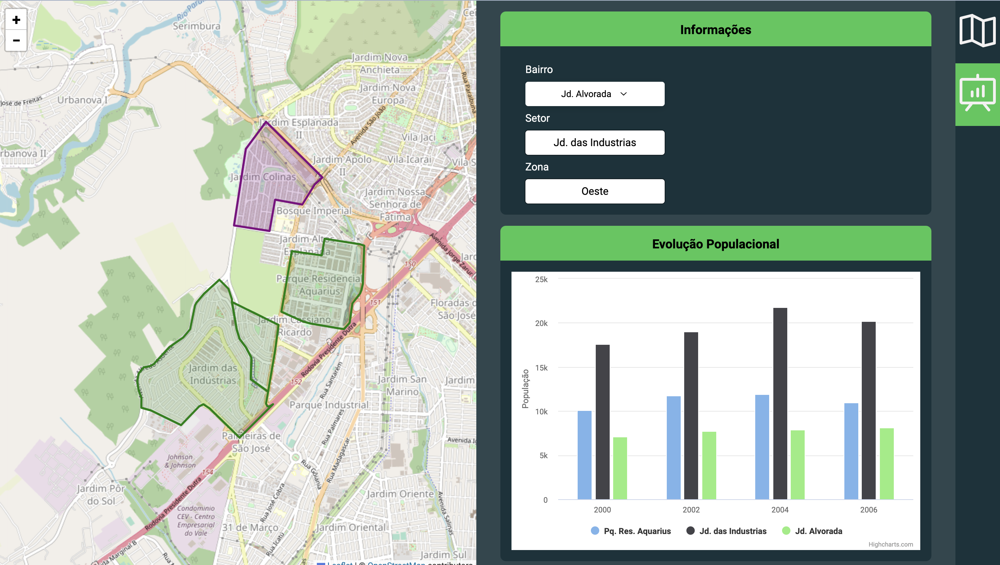

# Cities Neighborhood Population

This is a solution to a challenge of an interview process. 

<p align='center'></p>

## Challenge Description

Create a visually stunning web interface that showcases population data using the JSON files provided with this test. The interface should feature a sleek map displaying each neighborhood, accompanied by a dynamic chart (line or bar) showcasing the evolution of population numbers over time for each neighborhood. Make use of modern design elements to create a polished and engaging user experience.

- [Project link](https://map-cities-population-reactjs.vercel.app/)

## Preparing the environment
First of all you must install the dependencies:

- [Node.js](https://nodejs.org/en/blog/release/v18.14.0/) v18.14.0
- [Typescript](https://www.typescriptlang.org/) 4.9.5

---

## Running

- Install the dependencies

```bash
$ npm install
```

- Start the project in development mode

```bash
$ npm run dev
```
